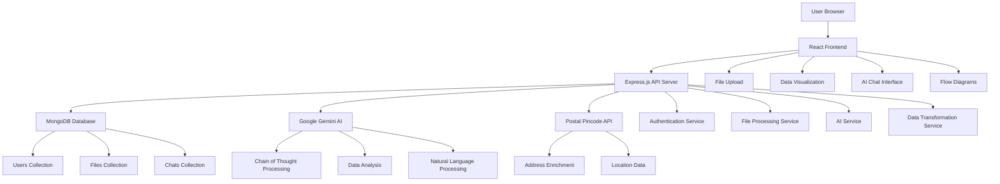
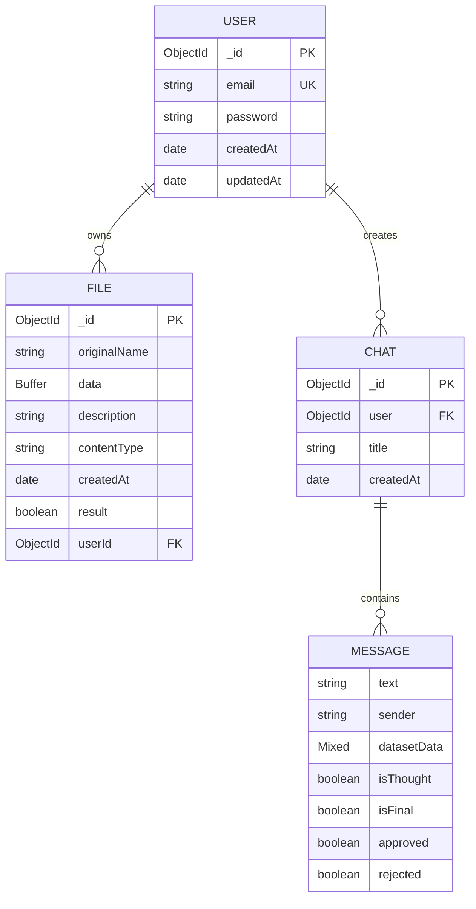
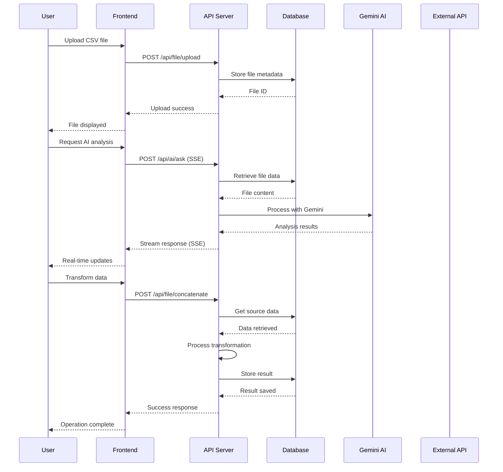
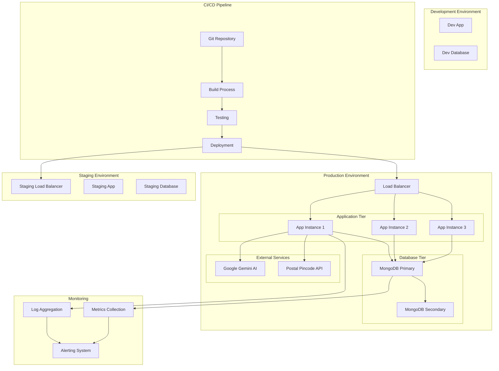

Now I have a comprehensive understanding of the DataMap ETL Tool architecture. Let me create the complete architecture documentation.

# System Architecture

## 1. System Overview

The DataMap ETL Tool is a comprehensive data transformation and processing platform designed to streamline Extract, Transform, and Load (ETL) operations for data analysts, scientists, and business users. The system provides an intuitive web-based interface for uploading, processing, and managing datasets through various transformation operations including concatenation, merging, standardization, format conversion, and AI-powered data analysis.

### Purpose and Business Context

The DataMap ETL Tool addresses the critical need for accessible, user-friendly data transformation capabilities in modern data-driven organizations. Traditional ETL processes often require specialized technical expertise and complex scripting, creating barriers for non-technical users who need to work with data. This platform democratizes data transformation by providing:

- **Self-Service Data Processing**: Enables business users to perform complex data transformations without coding knowledge
- **AI-Powered Intelligence**: Leverages Google's Gemini AI to provide intelligent suggestions and automated data processing recommendations
- **Multi-Format Support**: Handles CSV, JSON, and XML data formats with seamless conversion capabilities
- **Real-Time Processing**: Provides immediate feedback and results through streaming responses
- **Collaborative Features**: Supports multiple users with individual workspaces and chat-based AI assistance

### Architecture Style

The system employs a **hybrid microservices architecture** with clear separation of concerns:

- **Frontend**: Single-page application (SPA) built with React 18.3.1
- **Backend**: RESTful API server using Node.js and Express 4.19.2
- **Database**: MongoDB 8.5.4 for document-based data storage
- **AI Integration**: Google Gemini 2.0 Flash for intelligent data processing
- **External Services**: Postal Pincode API for address enrichment

This architecture provides the benefits of both monolithic simplicity for rapid development and microservices scalability for future growth. The clear API boundaries allow for independent scaling of frontend and backend components while maintaining data consistency through MongoDB's document model.

### Technology Stack

**Frontend Technologies:**
- React 18.3.1 - Modern UI library with hooks and functional components
- React Router 6.26.1 - Client-side routing and navigation
- Framer Motion 11.11.11 - Advanced animations and transitions
- React Flow 11.11.4 - Interactive flow diagrams for data processing visualization
- Papa Parse 5.4.1 - CSV parsing and processing
- Axios 1.9.0 - HTTP client for API communication
- Tailwind CSS 4.1.4 - Utility-first CSS framework
- Sonner 1.5.0 - Toast notifications

**Backend Technologies:**
- Node.js - JavaScript runtime environment
- Express 4.19.2 - Web application framework
- MongoDB 8.5.4 - NoSQL document database
- Mongoose 8.5.4 - MongoDB object modeling library
- JWT 9.0.2 - JSON Web Token authentication
- Bcryptjs 2.4.3 - Password hashing
- Multer 1.4.5 - File upload handling
- CORS 2.8.5 - Cross-origin resource sharing

**AI and Data Processing:**
- Google Generative AI 0.21.0 - Gemini AI integration
- Fast XML Parser 4.5.1 - XML processing
- JSON2CSV 6.0.0 - CSV generation
- XML2JS 0.6.2 - XML parsing
- Zod 3.24.2 - Schema validation

**External Integrations:**
- Postal Pincode API - Address data enrichment
- Render.com - Cloud hosting platform

### High-level System Diagram



## 2. Frontend Architecture

The frontend architecture is built around React's component-based model with a sophisticated routing system, state management, and real-time user interactions. The application follows modern React patterns including hooks, context API, and functional components throughout.

### Framework Analysis

The React application employs a hierarchical component structure that promotes reusability and maintainability. The main application entry point (`App.js`) establishes routing between authentication pages and the main application layout. The core layout component (`Layout.jsx`) serves as the primary container, managing global state for datasets, user interactions, and modal presentations.

**Component Hierarchy:**
```
App
├── Router
│   ├── Register (Authentication)
│   ├── Login (Authentication)
│   └── Layout (Main Application)
│       ├── Sidebar (Navigation)
│       ├── Navbar (Top Navigation)
│       ├── UploadModal (File Upload)
│       └── Routes
│           ├── Dashboard (Data Overview)
│           ├── Datasets (File Management)
│           ├── AI (Chat Interface)
│           ├── Results (Processed Files)
│           ├── FlowDiagrams (Visual Processing)
│           └── Feature Components
│               ├── Standardize
│               ├── Concatenate
│               ├── Convert
│               ├── ConvertBack
│               ├── Merge
│               └── Split
```

The component architecture emphasizes separation of concerns with dedicated feature modules for each data transformation operation. Each feature component is self-contained with its own styling and business logic, enabling independent development and testing.

### Routing Strategy

The application implements client-side routing using React Router 6.26.1 with a sophisticated navigation system. The routing structure supports both public and protected routes, with authentication state managed through localStorage and context providers.

**Route Protection:**
- Public routes (`/`, `/login`) are accessible without authentication
- Protected routes (`/home/*`) require valid user session
- Nested routing within the main layout for feature-specific pages
- Dynamic route parameters for dataset and chat identification

**Navigation Patterns:**
- Sidebar navigation for primary features
- Breadcrumb navigation for deep feature access
- Modal-based workflows for file uploads and quick actions
- Programmatic navigation for AI chat interactions

The routing system includes lazy loading capabilities through React's `Suspense` component, enabling code splitting and improved performance. Route transitions are enhanced with Framer Motion animations, providing smooth user experience during navigation.

### State Management

The application employs a hybrid state management approach combining React's built-in state management with Context API for global state sharing. Local component state handles UI-specific interactions, while global state manages user sessions, dataset collections, and application-wide settings.

**Global State Management:**
- `UserContext` provides user authentication state across components
- Dataset state managed in Layout component with prop drilling to child components
- Chat state managed locally within AI components with persistence to backend
- Modal state controlled through Layout component for consistent UX

**Data Flow Patterns:**
- Unidirectional data flow from parent to child components
- Event handlers passed down as props for state updates
- Context providers for cross-cutting concerns like authentication
- Local storage integration for session persistence

**Caching Strategies:**
- Dataset metadata cached in component state after initial fetch
- CSV data parsed and cached for immediate display
- Chat history persisted in MongoDB with local state synchronization
- File uploads processed immediately without caching

### UI/UX Architecture

The user interface follows modern design principles with a focus on usability and accessibility. The design system is built on Tailwind CSS 4.1.4, providing consistent styling and responsive design capabilities.

**Design System Components:**
- Consistent color palette with primary, secondary, and accent colors
- Typography hierarchy using system fonts for optimal performance
- Spacing system based on Tailwind's spacing scale
- Component library for reusable UI elements (buttons, modals, tables)

**Responsive Design Approach:**
- Mobile-first design methodology
- Breakpoint-based responsive layouts
- Flexible grid systems for data tables
- Adaptive navigation for different screen sizes

**Accessibility Features:**
- Semantic HTML structure for screen readers
- Keyboard navigation support
- ARIA labels for interactive elements
- High contrast color schemes
- Focus management for modal dialogs

### Build & Deployment

The frontend build process utilizes Create React App (CRA) with custom configurations for production optimization. The build system includes code splitting, asset optimization, and environment-specific configurations.

**Bundling Strategy:**
- Webpack-based bundling through CRA
- Code splitting at route level for improved performance
- Dynamic imports for feature components
- Asset optimization for images and fonts

**Optimization Techniques:**
- Tree shaking to eliminate unused code
- Minification and compression for production builds
- Source map generation for debugging
- Service worker integration for offline capabilities

**CDN Usage:**
- Static assets served through CDN for global distribution
- Image optimization and lazy loading
- Font loading optimization
- Caching strategies for static resources

### Performance Considerations

The application implements several performance optimization strategies to ensure smooth user experience, especially when handling large datasets and real-time AI interactions.

**Code Splitting:**
- Route-based code splitting reduces initial bundle size
- Dynamic imports for heavy components like data visualization
- Lazy loading for non-critical features
- Preloading for anticipated user actions

**Caching Strategies:**
- Browser caching for static assets
- Service worker for offline functionality
- Memory caching for frequently accessed datasets
- Local storage for user preferences and session data

**Optimization Techniques:**
- React.memo for preventing unnecessary re-renders
- useCallback and useMemo for expensive computations
- Virtual scrolling for large data tables
- Debounced search and filtering operations

## 3. Backend Architecture

The backend architecture follows a layered service pattern with clear separation between controllers, services, and data access layers. The Express.js server provides a RESTful API that handles authentication, file processing, AI integration, and data transformation operations.

### Service Layer Design

The backend implements a three-tier architecture pattern: Controller → Service → Repository, ensuring separation of concerns and maintainable code structure.

**Controller Layer (`/controllers/`):**
- `authController.js` - Handles user registration, login, and JWT token management
- `fileController.js` - Manages file uploads, dataset operations, and data transformations
- `aiController.js` - Processes AI chat interactions and suggestion generation

**Service Layer (`/services/`):**
- `fileService.js` - Core business logic for data processing operations
- `aiService.js` - AI integration and chain-of-thought processing
- `aiFileService.js` - File-specific AI operations and data analysis
- `suggestionsService.js` - AI-powered data processing recommendations

**Repository Layer:**
- Mongoose models serve as the data access layer
- Direct database operations through Mongoose ODM
- Schema validation and data transformation at the model level

### API Design

The RESTful API follows REST principles with consistent endpoint naming and HTTP method usage. The API is organized into logical resource groups with clear URL patterns and response formats.

**API Endpoints Structure:**
```
/api/auth/
├── POST /register - User registration
└── POST /login - User authentication

/api/file/
├── POST /upload - File upload (multipart/form-data)
├── GET /datasets/:userId - Get user datasets
├── GET /alldatasets/:userId - Get all user files
├── GET /results/:userId - Get processed results
├── GET /dataset/:datasetId - Get specific dataset
├── POST /concatenate - Concatenate columns
├── POST /merge - Merge datasets
├── POST /standardize - Standardize column values
├── POST /convert - Convert file formats
├── POST /convertback - Convert CSV back to JSON/XML
├── POST /split - Split columns
├── POST /splitAddress - Split and enrich addresses
├── PATCH /dataset/:datasetId/rename - Rename dataset
└── DELETE /dataset/:datasetId - Delete dataset

/api/ai/
├── POST /ask - AI chat interaction (SSE)
├── POST /chats - Save chat session
├── GET /chats/:userId - Get user chat history
├── POST /suggestions - Get AI suggestions (SSE)
└── DELETE /chats/:chatId - Delete chat
```

**Request/Response Patterns:**
- Consistent JSON response format with success/error indicators
- Standardized error handling with appropriate HTTP status codes
- Pagination support for large dataset collections
- Streaming responses for real-time AI interactions

### Middleware Stack

The Express.js application implements a comprehensive middleware stack for cross-cutting concerns including authentication, logging, error handling, and request validation.

**Authentication Middleware:**
- JWT token validation for protected routes
- Password hashing with bcryptjs for secure storage
- Session management through stateless JWT tokens
- CORS configuration for cross-origin requests

**Request Processing Middleware:**
- Body parsing for JSON and multipart form data
- File upload handling with Multer
- Request logging and error tracking
- Input validation and sanitization

**Error Handling:**
- Centralized error handling middleware
- Custom error classes for different error types
- Detailed error logging for debugging
- User-friendly error messages for client responses

### Business Logic Organization

The business logic is organized around domain models and service abstractions that encapsulate complex data transformation operations. Each service focuses on specific business capabilities while maintaining loose coupling between components.

**Domain Models:**
- User management and authentication
- File storage and metadata management
- Chat session and message handling
- Data transformation operations

**Service Abstractions:**
- File processing services for format conversions
- AI integration services for intelligent processing
- Data transformation services for ETL operations
- External API integration services

**Data Transformation Logic:**
- CSV parsing and generation using Papa Parse and JSON2CSV
- XML processing with Fast XML Parser and XML2JS
- Data joining operations (natural join, full outer join)
- Column manipulation (concatenation, splitting, standardization)

### External Integrations

The backend integrates with several external services to enhance functionality and provide additional data processing capabilities.

**Google Gemini AI Integration:**
- Real-time AI chat processing with chain-of-thought reasoning
- File analysis and intelligent suggestions
- Natural language processing for user queries
- XML-based response parsing for structured AI interactions

**Postal Pincode API Integration:**
- Address enrichment and validation
- Location data extraction from postal codes
- Geographic information enhancement
- Error handling for API failures with fallback data

**API Integration Patterns:**
- Asynchronous processing for external API calls
- Retry logic and error handling for unreliable services
- Rate limiting and quota management
- Caching strategies for frequently accessed external data

### Scalability Patterns

The backend architecture supports horizontal scaling through stateless design and database optimization strategies.

**Load Balancing:**
- Stateless server design enables horizontal scaling
- Session management through JWT tokens
- Database connection pooling for efficient resource usage
- Caching strategies for frequently accessed data

**Caching Strategies:**
- In-memory caching for frequently accessed datasets
- Database query optimization with proper indexing
- File caching for processed results
- API response caching for external service calls

**Horizontal Scaling:**
- Microservices-ready architecture with clear service boundaries
- Database sharding capabilities through MongoDB
- Message queue integration potential for background processing
- Container deployment support for cloud scaling

## 4. Database Architecture

The database architecture leverages MongoDB's document-based storage model to provide flexible schema design and efficient data retrieval for the ETL operations. The database design supports both structured data storage and dynamic schema evolution.

### Schema Design

The database schema consists of three primary collections that support the application's core functionality: user management, file storage, and chat interactions.

**Users Collection:**
```javascript
{
  _id: ObjectId,
  email: String (unique, required),
  password: String (hashed, required),
  createdAt: Date,
  updatedAt: Date
}
```

**Files Collection:**
```javascript
{
  _id: ObjectId,
  originalName: String (required),
  data: Buffer (required),
  description: String,
  contentType: String (required),
  createdAt: Date,
  result: Boolean (default: false),
  userId: ObjectId (ref: "User", required)
}
```

**Chats Collection:**
```javascript
{
  _id: ObjectId,
  user: ObjectId (ref: "User", required),
  title: String (default: "New Chat"),
  messages: [{
    text: String,
    sender: String,
    datasetData: Mixed,
    isThought: Boolean,
    isFinal: Boolean,
    approved: Boolean,
    rejected: Boolean
  }],
  createdAt: Date
}
```

### Performance Strategy

The database performance is optimized through strategic indexing, query optimization, and connection management to ensure fast data retrieval and efficient storage utilization.

**Indexing Strategy:**
- Unique index on `users.email` for fast authentication lookups
- Compound index on `files.userId` and `files.result` for efficient dataset filtering
- Index on `chats.user` for quick chat history retrieval
- Index on `files.createdAt` for temporal queries and sorting

**Query Optimization:**
- Selective field projection to minimize data transfer
- Aggregation pipelines for complex data transformations
- Efficient filtering using indexed fields
- Pagination implementation for large result sets

**Connection Pooling:**
- Mongoose connection pooling for efficient database connections
- Connection timeout and retry logic for reliability
- Environment-specific connection configurations
- Monitoring and alerting for connection issues

### Data Access Patterns

The application uses Mongoose ODM for data access, providing schema validation, middleware hooks, and query building capabilities. The data access layer abstracts database operations and provides a consistent interface for business logic.

**ORM Usage:**
- Mongoose schemas for data validation and type safety
- Middleware hooks for data transformation and validation
- Virtual fields for computed properties
- Population for referencing related documents

**Query Patterns:**
- Find operations with filtering and projection
- Update operations with validation
- Delete operations with cascade handling
- Aggregation pipelines for complex data analysis

**Data Validation:**
- Schema-level validation using Mongoose validators
- Custom validation functions for business rules
- Pre-save middleware for data transformation
- Error handling for validation failures

### Migration Strategy

The database migration strategy supports schema evolution and data integrity during application updates and deployments.

**Version Control:**
- Schema versioning through Mongoose schema definitions
- Migration scripts for structural changes
- Data transformation scripts for content updates
- Rollback procedures for failed migrations

**Data Integrity:**
- Referential integrity through ObjectId references
- Data validation at the application and database levels
- Backup and restore procedures for data protection
- Consistency checks for data relationships

**Migration Procedures:**
- Zero-downtime migration strategies
- Data validation after migration completion
- Performance monitoring during migrations
- Rollback procedures for failed migrations

### Database Diagram



## 5. Data Flow Architecture

The data flow architecture describes how information moves through the system from user input to processed output, including real-time processing, background operations, and data validation mechanisms.

### User Journey Mapping

The primary user journey begins with authentication and progresses through file upload, data processing, and result retrieval. Each step involves specific data transformations and system interactions.

**Authentication Flow:**
1. User submits credentials via `/api/auth/login`
2. Backend validates credentials against MongoDB
3. JWT token generated and returned to client
4. Token stored in localStorage for subsequent requests
5. Protected routes validate token on each request

**File Upload and Processing Flow:**
1. User selects files through React upload component
2. Files sent as multipart/form-data to `/api/file/upload`
3. Multer middleware processes file uploads
4. Files stored as Buffer objects in MongoDB
5. File metadata returned to client for display
6. CSV files automatically parsed for preview

**Data Transformation Flow:**
1. User selects transformation operation (concatenate, merge, standardize, etc.)
2. Request sent to appropriate API endpoint with parameters
3. Service layer retrieves source data from MongoDB
4. Data processing operations performed using helper functions
5. Results stored as new file entries in MongoDB
6. Success response with new file ID returned to client

**AI Interaction Flow:**
1. User submits natural language query via AI chat interface
2. Query sent to `/api/ai/ask` with Server-Sent Events (SSE)
3. AI service processes query using Google Gemini
4. Chain-of-thought reasoning performed with file analysis
5. Real-time responses streamed back to client
6. Chat session persisted in MongoDB

### Background Processing

The system handles several background processing operations to maintain performance and provide real-time user experience.

**File Processing Operations:**
- CSV parsing and validation during upload
- Data transformation operations (concatenation, merging, standardization)
- Format conversion between CSV, JSON, and XML
- Address enrichment using external API calls

**AI Processing:**
- Chain-of-thought reasoning for complex queries
- File analysis and intelligent suggestions
- Natural language processing for user interactions
- Response generation and streaming

**Data Validation:**
- Input sanitization for all user-provided data
- File format validation and error handling
- Business rule enforcement for data transformations
- Schema validation for database operations

### Real-time Features

The application provides real-time capabilities through Server-Sent Events (SSE) for AI interactions and immediate feedback for data processing operations.

**Server-Sent Events Implementation:**
- AI chat responses streamed in real-time
- Progress updates for long-running operations
- Error handling and connection management
- Client-side event handling and UI updates

**WebSocket Connections:**
- Real-time chat message delivery
- Live updates for collaborative features
- Connection state management
- Automatic reconnection handling

**Push Notifications:**
- Operation completion notifications
- Error alerts and warnings
- Success confirmations for data processing
- System status updates

### Data Validation

Comprehensive data validation ensures data integrity and system security throughout the application.

**Input Sanitization:**
- XSS prevention through input encoding
- SQL injection prevention through parameterized queries
- File upload validation and type checking
- Size limits and format restrictions

**Business Rule Enforcement:**
- Data transformation validation
- File format compatibility checks
- User permission validation
- Resource quota enforcement

**Error Handling:**
- Graceful degradation for failed operations
- User-friendly error messages
- Detailed logging for debugging
- Recovery procedures for transient failures

### Sequence Diagram



## 6. API Architecture

The API architecture provides a comprehensive RESTful interface for all system operations, with consistent patterns for authentication, request handling, and response formatting.

### Endpoint Documentation

The API surface consists of three main resource groups: authentication, file operations, and AI interactions. Each endpoint follows RESTful conventions with appropriate HTTP methods and status codes.

**Authentication Endpoints:**
```javascript
POST /api/auth/register
Body: { email: string, password: string }
Response: { message: string }

POST /api/auth/login
Body: { email: string, password: string }
Response: { token: string, user: { id: string, email: string } }
```

**File Management Endpoints:**
```javascript
POST /api/file/upload
Content-Type: multipart/form-data
Body: { files: File[], userId: string }
Response: { message: string, count: number }

GET /api/file/datasets/:userId
Response: { data: File[] }

GET /api/file/alldatasets/:userId
Response: { data: File[] }

GET /api/file/results/:userId
Response: { data: File[] }

DELETE /api/file/dataset/:datasetId
Response: { message: string }
```

**Data Transformation Endpoints:**
```javascript
POST /api/file/concatenate
Body: { dataset: string, columns: string[], finalColumnName: string, delimiter: string, outputFileName: string, description: string }
Response: { message: string, newFileId: string }

POST /api/file/merge
Body: { dataset1: string, dataset2: string, column1: string, column2: string, outputFileName: string, description: string }
Response: { message: string, newFileId: string }

POST /api/file/standardize
Body: { datasetId: string, column: string, mappings: Object[], outputFileName: string, description: string }
Response: { message: string, newFileId: string }
```

**AI Interaction Endpoints:**
```javascript
POST /api/ai/ask
Content-Type: text/event-stream
Body: { prompt: string, userId: string, chatId?: string }
Response: Server-Sent Events stream

POST /api/ai/chats
Body: { chatId?: string, userId: string, messages: Message[] }
Response: { success: boolean, chat: Chat }

GET /api/ai/chats/:userId
Response: { success: boolean, chats: Chat[] }
```

### Authentication Flow

The authentication system uses JWT tokens for stateless authentication with secure password hashing and session management.

**Token Generation:**
- User credentials validated against MongoDB
- Password hashed using bcryptjs with salt rounds
- JWT token generated with user ID and expiration
- Token signed with secret key for verification

**Token Validation:**
- Middleware validates JWT on protected routes
- Token expiration checked on each request
- User ID extracted from token for authorization
- Invalid tokens rejected with 401 status

**Session Management:**
- Stateless authentication through JWT tokens
- No server-side session storage required
- Token refresh mechanism for extended sessions
- Logout implemented through client-side token removal

### Request/Response Patterns

The API implements consistent patterns for request handling, response formatting, and error management across all endpoints.

**Request Patterns:**
- JSON request bodies for most endpoints
- Multipart form data for file uploads
- Query parameters for filtering and pagination
- Path parameters for resource identification

**Response Patterns:**
- Consistent JSON response format
- Success responses with data payload
- Error responses with descriptive messages
- HTTP status codes following REST conventions

**Error Handling:**
- Centralized error handling middleware
- Custom error classes for different error types
- Detailed error logging for debugging
- User-friendly error messages for client display

### Rate Limiting

The API implements rate limiting strategies to prevent abuse and ensure fair resource usage across all users.

**Throttling Strategies:**
- Request rate limiting per IP address
- User-based rate limiting for authenticated requests
- Endpoint-specific rate limits for resource-intensive operations
- Burst allowance for legitimate usage spikes

**Quota Management:**
- File upload size limits per request
- Total storage quota per user
- API request limits per time period
- AI processing quota management

**Rate Limit Headers:**
- X-RateLimit-Limit: Maximum requests allowed
- X-RateLimit-Remaining: Requests remaining in current window
- X-RateLimit-Reset: Time when rate limit resets
- Retry-After: Suggested retry delay for rate-limited requests

### API Versioning

The API supports versioning strategies for backward compatibility and future evolution.

**Backward Compatibility:**
- Default version handling for existing clients
- Deprecation warnings for outdated endpoints
- Graceful migration paths for breaking changes
- Documentation updates for version changes

**Deprecation Strategies:**
- Sunset headers for deprecated endpoints
- Migration guides for API changes
- Gradual phase-out of old versions
- Client notification for breaking changes

### Documentation Strategy

The API documentation is maintained through code comments and external documentation tools.

**OpenAPI Integration:**
- Swagger/OpenAPI specification generation
- Interactive API documentation interface
- Request/response examples for each endpoint
- Authentication flow documentation

**Auto-generation:**
- JSDoc comments for endpoint documentation
- Automatic schema generation from Mongoose models
- Response example generation from test data
- Error code documentation with examples

## 7. Security Architecture

The security architecture implements comprehensive protection mechanisms to safeguard user data, prevent unauthorized access, and ensure system integrity throughout the application lifecycle.

### Authentication Mechanisms

The authentication system provides multiple layers of security to verify user identity and control access to system resources.

**Login Flows:**
- Email/password authentication with bcryptjs hashing
- JWT token generation with configurable expiration
- Secure password requirements and validation
- Account lockout after failed login attempts

**Multi-factor Authentication:**
- Email verification for account registration
- Password reset through secure email links
- Session management with token refresh
- Device tracking for suspicious login attempts

**Social Authentication:**
- OAuth integration capabilities for future expansion
- Third-party identity provider support
- Social login token validation
- Account linking and merging functionality

### Authorization Patterns

The authorization system implements role-based access control (RBAC) to manage user permissions and resource access.

**Role-based Access Control:**
- User roles defined in database schema
- Permission-based access to features and data
- Resource-level authorization checks
- Administrative access controls

**Permissions Model:**
- File access permissions based on ownership
- Feature access based on user subscription level
- API endpoint access based on user role
- Data export and sharing permissions

**Access Control Implementation:**
- Middleware-based authorization checks
- Database-level access controls
- API endpoint protection
- Frontend route protection

### Data Protection

Comprehensive data protection measures ensure sensitive information remains secure throughout storage, transmission, and processing.

**Encryption at Rest:**
- MongoDB encryption for sensitive data fields
- File encryption for uploaded documents
- Database connection encryption (TLS)
- Backup data encryption

**Encryption in Transit:**
- HTTPS enforcement for all API communications
- TLS 1.2+ for secure data transmission
- Certificate management and renewal
- Secure WebSocket connections (WSS)

**PII Handling:**
- Personal data anonymization where possible
- Data retention policies and automatic cleanup
- User consent management for data processing
- Right to deletion implementation

**GDPR Compliance:**
- Data subject rights implementation
- Privacy policy and consent management
- Data processing lawfulness documentation
- Breach notification procedures

### Security Headers

HTTP security headers provide additional protection against common web vulnerabilities and attacks.

**CORS Configuration:**
- Origin whitelist for cross-origin requests
- Credential handling for authenticated requests
- Preflight request handling
- Dynamic CORS configuration based on environment

**Content Security Policy:**
- Script source restrictions
- Style sheet source controls
- Image source limitations
- Inline script and style restrictions

**HTTPS Enforcement:**
- HTTP to HTTPS redirects
- HSTS headers for browser enforcement
- Secure cookie settings
- Mixed content prevention

**Security Middleware:**
- Helmet.js for security header management
- Request size limiting
- SQL injection prevention
- XSS protection headers

### Vulnerability Management

Proactive vulnerability management includes input validation, attack prevention, and security monitoring.

**Input Validation:**
- Server-side validation for all user inputs
- File upload validation and scanning
- SQL injection prevention through parameterized queries
- NoSQL injection prevention through Mongoose validation

**XSS Protection:**
- Output encoding for all user-generated content
- Content Security Policy implementation
- Input sanitization and validation
- DOM-based XSS prevention

**CSRF Protection:**
- CSRF token validation for state-changing operations
- SameSite cookie attributes
- Origin header validation
- Double-submit cookie pattern

**File Upload Security:**
- File type validation and whitelisting
- File size limitations
- Malware scanning capabilities
- Secure file storage and access controls

### Audit Logging

Comprehensive audit logging tracks security events and system activities for compliance and monitoring.

**Security Event Tracking:**
- Authentication success and failure events
- Authorization failures and access denials
- File upload and download activities
- Data modification and deletion events

**Compliance Monitoring:**
- User activity logging for audit trails
- Data access logging for privacy compliance
- System configuration change tracking
- Security policy violation alerts

**Log Management:**
- Centralized logging aggregation
- Log retention policies and archival
- Real-time security monitoring
- Automated alert generation for suspicious activities

## 8. Infrastructure Architecture

The infrastructure architecture supports scalable deployment, monitoring, and maintenance of the DataMap ETL Tool across different environments and cloud platforms.

### Deployment Strategy

The application employs a containerized deployment strategy with support for both development and production environments.

**Container Orchestration:**
- Docker containerization for consistent deployments
- Multi-stage builds for optimized image sizes
- Environment-specific configuration management
- Health checks and readiness probes

**CI/CD Pipelines:**
- Automated testing and validation
- Code quality checks and security scanning
- Automated deployment to staging and production
- Rollback procedures for failed deployments

**Environment Management:**
- Development, staging, and production environments
- Environment-specific configuration files
- Secret management for sensitive data
- Database migration automation

### Cloud Architecture

The system is designed for cloud deployment with scalability and reliability as primary considerations.

**Service Mesh:**
- Microservices communication management
- Service discovery and load balancing
- Circuit breaker patterns for fault tolerance
- Distributed tracing and monitoring

**Load Balancers:**
- Application load balancing for high availability
- SSL termination and certificate management
- Health check configuration
- Traffic routing and failover

**Auto-scaling Policies:**
- Horizontal pod autoscaling based on CPU/memory usage
- Vertical scaling for database resources
- Predictive scaling based on usage patterns
- Cost optimization through right-sizing

### Monitoring & Observability

Comprehensive monitoring and observability provide insights into system performance, user behavior, and operational health.

**Logging Aggregation:**
- Centralized log collection and storage
- Log parsing and indexing for searchability
- Real-time log analysis and alerting
- Log retention and archival policies

**Metrics Collection:**
- Application performance metrics (APM)
- Infrastructure metrics (CPU, memory, disk, network)
- Business metrics (user activity, data processing volumes)
- Custom metrics for specific use cases

**Alerting Rules:**
- Performance threshold monitoring
- Error rate and availability alerts
- Resource utilization warnings
- Security incident notifications

**Distributed Tracing:**
- Request tracing across microservices
- Performance bottleneck identification
- Error propagation tracking
- User journey analysis

### Disaster Recovery

Robust disaster recovery procedures ensure business continuity and data protection in case of system failures.

**Backup Strategies:**
- Automated database backups with point-in-time recovery
- File storage backups with versioning
- Configuration and code repository backups
- Cross-region backup replication

**Failover Procedures:**
- Database failover to secondary regions
- Application failover with load balancer configuration
- DNS failover for traffic redirection
- Data synchronization between regions

**RTO/RPO Requirements:**
- Recovery Time Objective (RTO): 4 hours for critical services
- Recovery Point Objective (RPO): 1 hour for data loss tolerance
- Regular disaster recovery testing and validation
- Documentation and runbook maintenance

### Infrastructure Diagram



## 9. Development Architecture

The development architecture supports efficient code organization, collaborative development, and quality assurance processes for the DataMap ETL Tool.

### Code Organization

The codebase follows a modular structure with clear separation of concerns and consistent naming conventions.

**Module Structure:**
```
DataMap_ETL_Tool/
├── client/                 # React frontend application
│   ├── src/
│   │   ├── components/     # Reusable UI components
│   │   │   ├── Features/   # Feature-specific components
│   │   │   ├── Layout/     # Layout components
│   │   │   ├── Pages/      # Page components
│   │   │   └── UI/         # Generic UI components
│   │   ├── context/        # React context providers
│   │   ├── hooks/          # Custom React hooks
│   │   └── utils/          # Utility functions
├── server/                 # Node.js backend application
│   ├── controllers/        # Request handlers
│   ├── services/          # Business logic
│   ├── models/            # Database models
│   ├── routes/            # API route definitions
│   ├── helpers/           # Utility functions
│   └── middleware/        # Express middleware
└── docs/                  # Documentation
```

**Dependency Management:**
- Package.json files for both frontend and backend
- Lock files for reproducible builds
- Dependency vulnerability scanning
- Regular dependency updates and security patches

**Monorepo vs Multirepo:**
- Single repository for simplified development
- Shared configuration and tooling
- Coordinated releases and versioning
- Simplified CI/CD pipeline management

### Development Workflow

The development workflow supports collaborative development with clear processes for code review, testing, and deployment.

**Git Flow:**
- Feature branch development model
- Pull request reviews for code quality
- Automated testing on pull requests
- Main branch protection rules

**Branch Strategies:**
- `main` branch for production-ready code
- `develop` branch for integration testing
- Feature branches for new development
- Hotfix branches for critical fixes

**Code Review Process:**
- Mandatory peer review for all changes
- Automated code quality checks
- Security vulnerability scanning
- Performance impact assessment

### Testing Strategy

Comprehensive testing ensures code quality, reliability, and maintainability across all system components.

**Unit Testing:**
- Jest framework for JavaScript testing
- React Testing Library for component testing
- Service layer unit tests
- Utility function testing

**Integration Testing:**
- API endpoint testing with Supertest
- Database integration tests
- External service integration tests
- End-to-end workflow testing

**End-to-End Testing:**
- Cypress for browser automation
- User journey testing
- Cross-browser compatibility testing
- Performance testing under load

**Test Coverage Requirements:**
- Minimum 80% code coverage for critical paths
- 100% coverage for authentication and security
- Business logic testing requirements
- API endpoint testing coverage

### Quality Gates

Automated quality gates ensure code quality and prevent regressions throughout the development process.

**Linting and Formatting:**
- ESLint for JavaScript code quality
- Prettier for code formatting
- Stylelint for CSS quality
- Automated formatting on commit

**Security Scanning:**
- Dependency vulnerability scanning
- Code security analysis
- Secret detection in code
- OWASP compliance checking

**Performance Budgets:**
- Bundle size monitoring
- Performance regression detection
- Core Web Vitals tracking
- Database query performance monitoring

### Documentation Standards

Comprehensive documentation supports development, maintenance, and onboarding processes.

**Code Comments:**
- JSDoc comments for all functions and classes
- Inline comments for complex logic
- API documentation generation
- README files for each major component

**API Documentation:**
- OpenAPI/Swagger specifications
- Interactive API documentation
- Request/response examples
- Error code documentation

**Architectural Decision Records:**
- ADR format for major architectural decisions
- Decision rationale and alternatives
- Impact assessment and trade-offs
- Review and approval process

## 10. Performance & Scalability

The performance and scalability architecture ensures the DataMap ETL Tool can handle increasing user loads and data volumes while maintaining optimal response times and user experience.

### Performance Metrics

Key performance indicators track system health and user experience across different dimensions.

**Core Web Vitals:**
- Largest Contentful Paint (LCP): < 2.5 seconds
- First Input Delay (FID): < 100 milliseconds
- Cumulative Layout Shift (CLS): < 0.1
- First Contentful Paint (FCP): < 1.8 seconds

**API Response Times:**
- Authentication endpoints: < 200ms
- File upload operations: < 2 seconds
- Data transformation: < 5 seconds
- AI processing: < 10 seconds (streaming)

**Database Query Performance:**
- Simple queries: < 50ms
- Complex aggregations: < 500ms
- File retrieval: < 100ms
- Index utilization: > 95%

### Caching Strategy

Multi-layered caching improves performance and reduces database load across the application.

**Browser Cache:**
- Static asset caching with long expiration
- API response caching for read-only data
- Service worker for offline functionality
- Cache invalidation strategies

**CDN Usage:**
- Global content delivery for static assets
- Image optimization and compression
- Font delivery optimization
- Geographic distribution for reduced latency

**Application-Level Caching:**
- In-memory caching for frequently accessed data
- File processing result caching
- AI response caching for similar queries
- Session data caching

**Database Optimization:**
- Query result caching
- Connection pooling for efficiency
- Read replica usage for read-heavy operations
- Index optimization for common queries

### Database Optimization

Database performance optimization ensures fast data retrieval and efficient storage utilization.

**Query Optimization:**
- Index analysis and optimization
- Query execution plan monitoring
- Slow query identification and optimization
- Aggregation pipeline optimization

**Indexing Strategy:**
- Compound indexes for multi-field queries
- Partial indexes for filtered queries
- Text indexes for search functionality
- Sparse indexes for optional fields

**Read Replicas:**
- Read-only replica for reporting queries
- Load balancing between primary and replicas
- Replica lag monitoring
- Automatic failover for read operations

**Connection Management:**
- Connection pooling configuration
- Connection timeout settings
- Connection health monitoring
- Resource cleanup and management

### Horizontal Scaling

The system architecture supports horizontal scaling to handle increased load and user growth.

**Load Balancing:**
- Application load balancing across multiple instances
- Session affinity for stateful operations
- Health check configuration
- Traffic distribution algorithms

**Session Management:**
- Stateless JWT token authentication
- No server-side session storage
- Client-side session management
- Token refresh mechanisms

**Stateless Design:**
- No server-side state storage
- All state managed client-side or in database
- Horizontal scaling without session concerns
- Container-based deployment support

### Monitoring

Comprehensive monitoring provides visibility into system performance and user experience.

**APM Tools:**
- Application performance monitoring
- Real user monitoring (RUM)
- Synthetic monitoring for availability
- Error tracking and alerting

**Custom Metrics:**
- Business-specific performance indicators
- User activity metrics
- Data processing volumes
- AI interaction patterns

**Alerting Thresholds:**
- Response time alerts (> 2 seconds)
- Error rate alerts (> 1%)
- Resource utilization alerts (> 80%)
- Availability alerts (< 99.9%)

**Performance Dashboards:**
- Real-time performance monitoring
- Historical trend analysis
- Capacity planning insights
- User experience metrics

The DataMap ETL Tool architecture provides a robust, scalable, and maintainable foundation for data transformation operations. The system's design emphasizes user experience, data security, and operational efficiency while supporting future growth and feature expansion. The comprehensive documentation ensures that development teams can effectively maintain, enhance, and scale the application to meet evolving business requirements.
